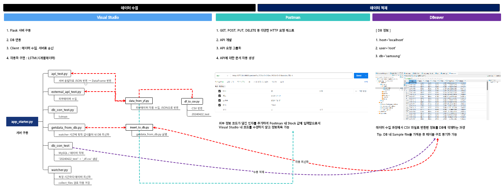
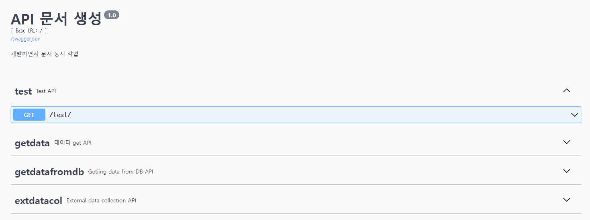
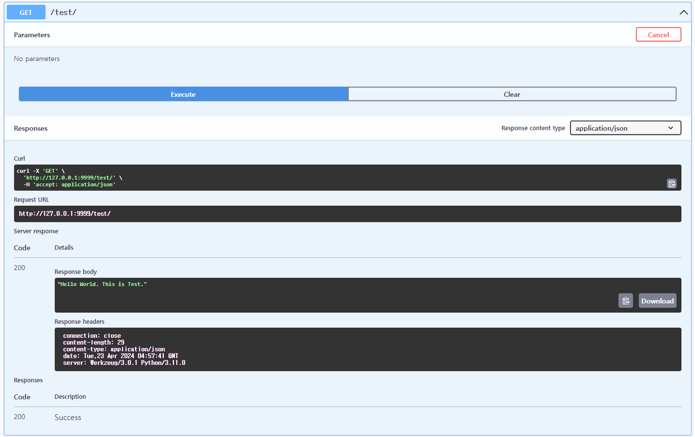
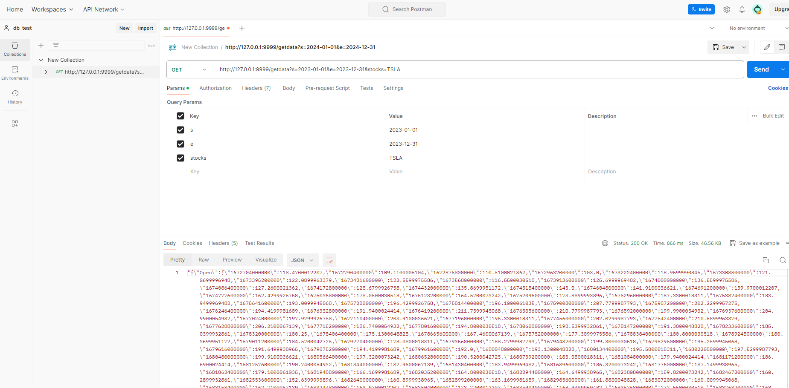

# Project_MLops

 

  

## Object

이 프로젝트는 Python, SQL 코드를 활용하여 데이터 수집부터 데이터베이스 적재까지의 일련의 과정을 자동화하는 것을 목표로 합니다.

또한 일정 시간마다 데이터를 최신화하여 보다 양질의 데이터를 제공하는 모델을 구축하고 있습니다.

  

## Content

1. Module 소개
2. 데이터 가져오기
3. 데이터 적재

  

### 1. Module 소개

 

- app_starter.py : 서버를 구동하는 메인 모듈입니다. ( __name__ == __main__ )
- api_test.py : 데이터를 요청하고 서버 응답자료를 받아 JSON 반환하고 DataFrame 형태로 처리합니다.
- getdata_from_db.py : watcher모델에서 지정한 시간에 맞춰 감시폴더 내 DB 최신화합니다.
- external_api_test.py : 외부데이터를 문자열로 수집하여 그 값을 반환합니다.

  

### 2. 데이터 가져오기

 

#### 2.1 Test Clss

 

- app_starter.py 실행하면 __name__ == __main__ 실행조건이 충족되어 Flask 애플리케이션에 API를 추가합니다.

  이 코드를 실행함으로써 API의 버전, 제목, 설명 등을 설정할 수 있습니다.

  [URL] http://127.0.0.1:9999/api-docs 

 

 

- api_test.py 실행으로 서버가 정상적으로 구동하는지 체크합니다.

  [URL] http://127.0.0.1:9999/test/

 

 

#### 2.2 GetData Class

- Getdata 클래스는 Test 클래스와 유사하나 data_from_yf 모듈을 호출하여 아래 기능을 수행합니다.
  - 얻고자 하는 사이트의 데이터 주소 or 코드를 입력하여 정보를 가져오는 기능
  - 가져온 정보를 json 형태로 변환하는 기능
  - 변환된 json 데이터를 temp.csv 파일로 별도 저장
  - 기존 json 데이터를 Flask의 jsonify() 함수를 사용하여 JSON 형식의 응답으로 반환

 

#### 2.3 GetDatafronDB Class

- GetdatafromDB 클래스는 getdata_from_db 모듈을 호출하여 아래 기능을 수행합니다.
  - db를 연결하는 작업을 수행

 

#### 2.4 ExternalDataCollection Class

- Getdata 클래스와 같이 외부 데이터를 연결하는 역할을 수행합니다.

 

#### 2.5 df_to_csv.py / df_to_excel.py

- 위 모듈과 독립적으로 yfinance에서 특정 주식코드 정보를 CSV or EXCEL 형태로 저장합니다.
- yfinance의 연결 상태체크 목적으로 설계된 모듈입니다.
- 또한 이후 DBeaver 데이터베이스 연동 시 테이블 자동 삽입을 위한 샘플 데이터로도 활용될 예정입니다.

  

## 3. Postman

- Postman은 API 개발 및 테스트를 위한 협업 도구로, API 엔드포인트를 만들고 테스트하고 문서화할 수 있는 플랫폼입니다.
- 외부 정보 코드가 담긴 인자를 추가하여 Postman 내 Stock 값에 입력함으로서 코드를 수정하지 않고 정보획득이 가능합니다.

 

 

