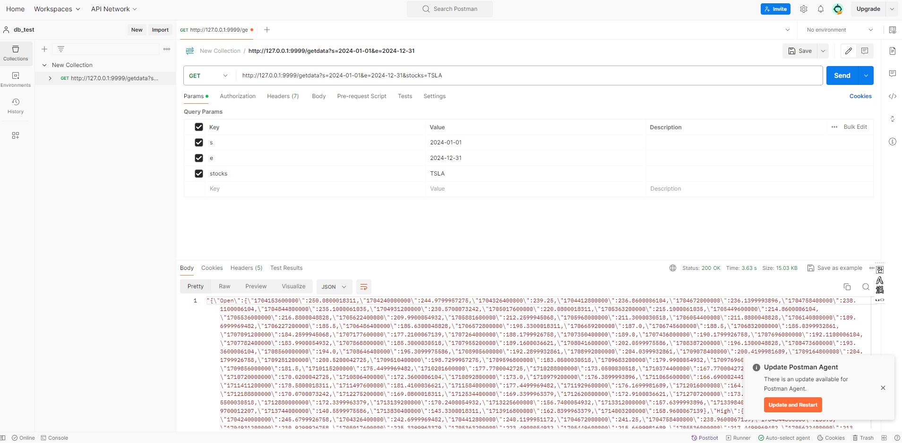
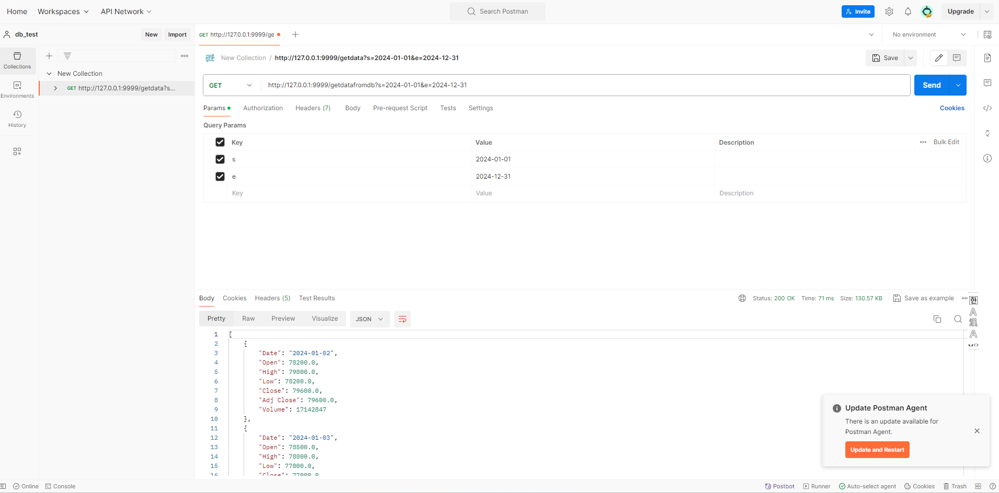

# Project_MLops

  

## Object

이 프로젝트는 Python, SQL 코드를 활용하여 데이터 수집부터 데이터베이스 적재까지의 일련의 과정을 자동화하는 것을 목표로 합니다.

또한 일정 시간마다 데이터를 최신화 과정을 자동화하여 보다 양질의 데이터를 제공하는 모델을 구축하고 있습니다.

  

## Content

1. Model 소개
2. 데이터 가져오기
3. 데이터 적재

  

### 1. Module 소개

 

- app_starter.py : 서버를 구동하는 메인 모듈입니다.

  ① api_test.py : API 생성 테스트, swagger 문서화하여 공유 자동화, 유지보수 설계

  ② data_from_yf.py : Postman 연동, 주식데이터 기반 날짜와 종목 인자 입력 후 외부데이터 가져오기

  ③ getdata_from_db.py : 수집 데이터가 들어오면 DBeaver 적재, watcher모델에서 지정한 시간에 맞춰 감시폴더 내 DB 최신화

  ④ external_api_test.py : 외부데이터를 문자열로 수집하여 그 값을 반환합니다.

- Test를 위한 모듈입니다.

  ① df_to_csv_test.py : 주식데이터 받아와서 DBeaver에 테스트겸 수동 적재 => 20240423_test

  ② Postman 활용해 getdata API 로 인자만 조정해서 원하는 날짜, 종목 추출 가능하도록 테스트

  ③ db_con_test.py : db와 파이썬 프로그렘이 연동되었는지 확인하기위해 db 테이블 목록 추출

 

  

### 2. 데이터 가져오기

 

#### 2.1 Test Clss

 

- app_starter.py 실행하면 __name__ == __main__ 실행조건이 충족되어 Flask 애플리케이션에 API를 추가합니다.

  이 코드를 실행함으로써 API의 버전, 제목, 설명 등을 설정할 수 있습니다.

  [URL] http://127.0.0.1:9999/api-docs 

 

 

- api_test.py 실행으로 서버가 정상적으로 구동하는지 체크합니다.

  [URL] http://127.0.0.1:9999/test/

 

 

#### 2.2 GetData Class

- Getdata 클래스는 Test 클래스와 유사하나 data_from_yf 모듈을 호출하여 아래 기능을 수행합니다.
  - 얻고자 하는 사이트의 데이터 주소 or 코드를 입력하여 정보를 가져오는 기능
  - 가져온 정보를 json 형태로 변환하는 기능
  - 변환된 json 데이터를 temp.csv 파일로 별도 저장
  - 기존 json 데이터를 Flask의 jsonify() 함수를 사용하여 JSON 형식의 응답으로 반환

 

#### 2.3 GetDatafronDB Class

- GetdatafromDB 클래스는 getdata_from_db 모듈을 호출하여 아래 기능을 수행합니다.
  - db를 연결하는 작업을 수행

 

#### 2.4 ExternalDataCollection Class

- Getdata 클래스와 같이 외부 데이터를 연결하는 역할을 수행합니다.

 

#### 2.5 df_to_csv.py / df_to_excel.py

- 위 모듈과 독립적으로 yfinance에서 특정 주식코드 정보를 CSV or EXCEL 형태로 저장합니다.
- yfinance의 연결 상태체크 목적으로 설계된 모듈입니다.
- 또한 이후 DBeaver 데이터베이스 연동 시 테이블 자동 삽입을 위한 샘플 데이터로도 활용될 예정입니다.

  

## 3. 데이터 가져오기 자동화 : Postman

- Postman은 API 개발 및 테스트를 위한 협업 도구로, API 엔드포인트를 만들고 테스트하고 문서화할 수 있는 플랫폼입니다.
- 외부 정보 코드가 담긴 인자를 추가하여 Postman 내 Stock 값에 입력함으로서 코드를 수정하지 않고 정보획득이 가능합니다.
- 본 Postman 적용 과정은 내가 지정한 Flask 서버로부터의 정보 외부수집에 대한 테스트 목적으로 수행하였습니다.

 

  

## 4. 데이터 적재 : DBeaver

- 이전 과정에서 단순히 Postman을 활용하여 외부 데이터를 수집하였습니다.
- 하지만 추가적인 작업을 위해서는 단순히 CSV 형태로 데이터를 수집하는 것이 아닌 DB로의 적재가 필요합니다.
- DBeaver는 오픈 소스의 다중 데이터베이스 관리 도구로 해당 DB로의 적재 과정을 소개합니다.
  - db_con_test.py : 내가 생성한 DB에 대한 연결을 수행하며 추가적으로 DB 쿼리문을 수행하는 기능
    - DB name : samsung / Table : 20240423_test 
    - 하지만 이 과정에서 Table 구조가 설정이 안되어 있을 경우 DBeaver 내 '가져오기' 기능으로 테이블을 구성합니다.

  

  

  - insert_to_db.py : getdata_from_db를 실행하는 파일, data_from_db.csv 을 감시하여 현재 시간 기준으로 최신화합니다.
  - getdata_from_db.py : watcher 이벤트 송신 시 내 DB와 연결 및 데이터를 삽입하는 기능을 수행합니다.
  - watcher.py : 디렉토리 대상을 감시한 후 일정 주기 별로 getdata_from_db.py에 이벤트를 송신합니다.

## 5. 데이터 수집 - 적재 시행

 

- 일련의 과정은 만약 어떠한 회사 부서에서 실행했을 시 단순 사내 DB에 적재할 경우가 있고,

  데이터 분석 한 모델을 필요로 하는 경우 등 다양한 공유 케이스가 있어 모델을 통합하지 않고 별도로 진행합니다.

 

### 5.1 데이터 가져오기

 

- 상기 모듈을 토대로 사용자 입장에서 yahoofinance 데이터를 가져오는 방법을 소개합니다.

1. app_starter.py 모델을 실행합니다. (서버 구축)
2. test_api 클래스를 활용하여 API 서버의 정상 구동 여부를 체크합니다.
3. GetData 클래스를 활용하여 Postman에서 s(시작일자), e(마감일자), stocks(주식코드)를 입력합니다. **(직접 실행1)**

 

 

4. Postman API에서 얻어온 데이터들이 모두 collect_files에 csv파일 형태로 저장됩니다.
5. collect_files에 파일이 저장되면 watcher.py 모듈이 변화를 감지하여 getdata_from_db.py 모듈을 실행시킵니다.
6. getdata_from_db.py은 DBeaver에 연결된 테이블에 그 내용을 최신화시킵니다. => 사내 DB 적재

### 5.2 데이터 적재 

 

- 분석가 입장에서 yahoofinance 에서 가져온 데이터를 적재 및 변환하는 방법을 소개합니다.

1. GetDataFromDB 클래스를 활용하여 Postman 에 s(시작일자), e(마감일자), stocks(주식코드)를 입력합니다. **(직접실행2)**  

 

 

2. Postman API 설정에 따른 결과값은 getdata_from_db.py 에서 설정한 cursor 에 따라

   DBeaver에 설정 기간 동안의 데이터를 가져와서 DataFrame으로 변환한 후, db_to_df 파일에 CSV 파일로 저장하는 과정을 수행합니다.

3. lstm.py 모듈을 실행하여 db_to_df 디렉토리에 업로드 파일이 들어올 때 최근 파일만 분석하여 향후 5일간 주가 예측을 수행합니다.

4. 예측을 수행한 모델은 models 파일에 저장되며 예측 그래프는 models 폴더에 저장됩니다.

