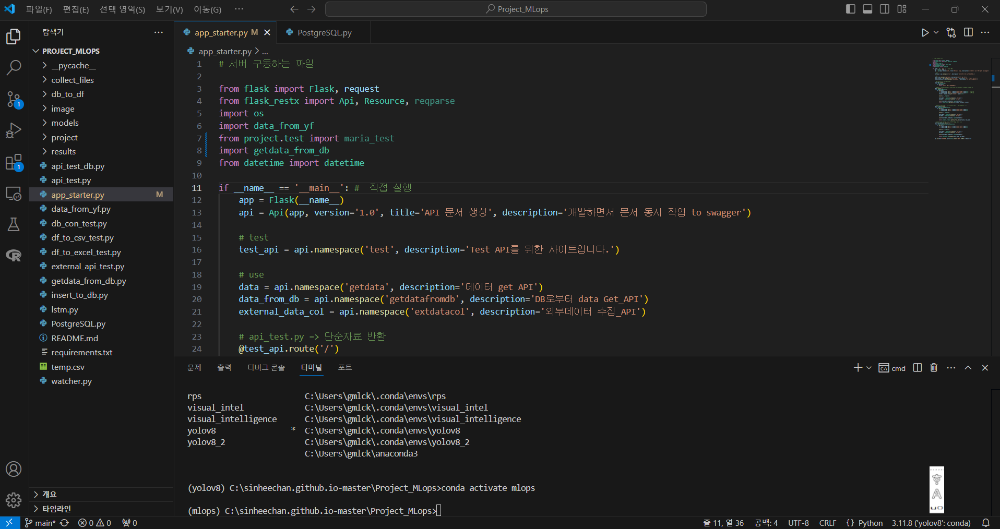
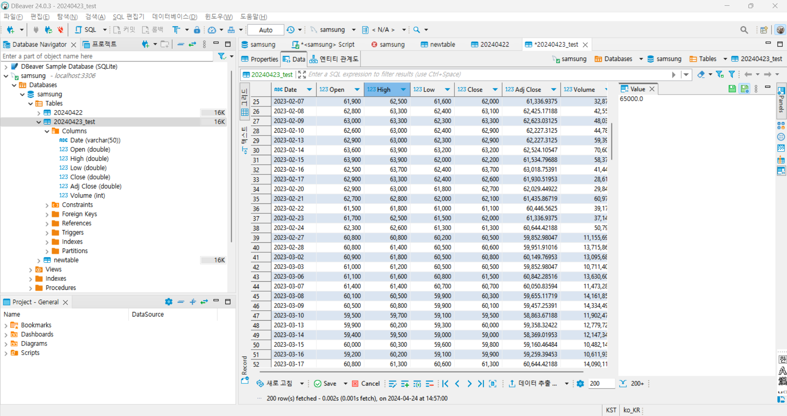
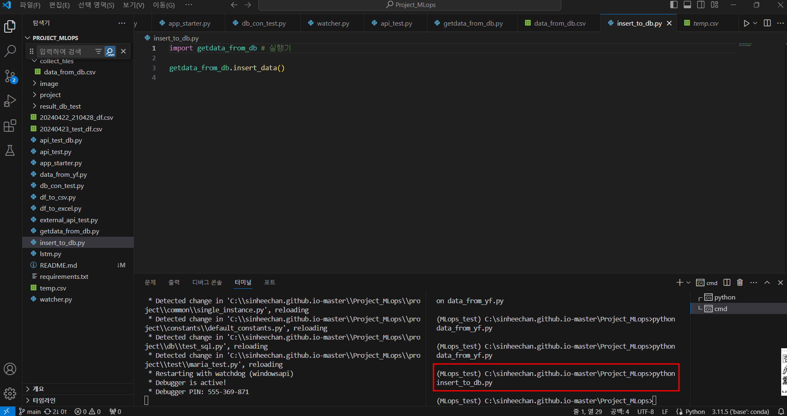

# Project_MLops

  

## Object

 

이 프로젝트는 Python, SQL 코드를 활용하여 데이터 수집부터 데이터베이스 적재까지의 일련의 과정을 자동화하는 것을 목표로 합니다.

또한 일정 시간마다 데이터를 최신화 과정을 자동화하여 보다 양질의 데이터를 제공하는 모델을 구축하고 있습니다.

  

## Content

 

1. Module 소개

2. 프로세스 정리

3. DB관리

4. BI 시각화

  

## 1. Module 소개

 

- app_starter.py : 서버를 구동하는 메인 모듈입니다.

  ① api_test.py class : API 생성 테스트, swagger 문서화하여 공유 자동화, 유지보수 설계 

  ② data_from_yf.py class : Postman 연동, 주식데이터 기반 날짜와 종목 인자 입력 후 외부데이터 가져오기

  ③ getdata_from_db.py class : 수집 데이터가 들어오면 DBeaver 적재, watcher모델에서 지정한 시간에 맞춰 감시폴더 내 DB 최신화

  ④ external_api_test.py class : 외부데이터를 문자열로 수집하여 그 값을 반환

- Test를 위한 모듈입니다.

  ① df_to_csv_test.py : 주식데이터 받아와서 DBeaver에 테스트겸 수동 적재 → 20241023_test

  ② Postman 활용해 getdata API 로 인자만 조정해서 원하는 날짜, 종목 추출 가능하도록 테스트 목적

  ③ db_con_test.py : db와 파이썬 프로그렘이 연동되었는지 확인하기위해 db 테이블 목록 추출 목적

 

  

## 2. 프로세스 구성

 

### ① API 생성

 

- `app_starter.py` 모듈 실행 후 생성된 API 주소 확인 후 API 구동 테스트 

  [URL] http://127.0.0.1:9999/api-docs 

 

 

- 생성된 `class TEST` 실행하여 서버 기반 정상적으로 구동하는지 체크, 공유를 위한 API 문서양식 저장

  [URL] http://127.0.0.1:9999/test/

 

 

### ② 데이터 수집

 

- `class GetData` 는 `data_from_yf` 모듈을 호출하여 원하는 인자 별 반환 된 데이터를 디렉토리에 저장

- `Postman` API 자동화 문서 연동 후 인자 입력에 따른 원하는 주식 데이터 수집

  - start : 시작 일자

  - end : 마감 일자

  - stocks : 주식 종목 명 (yahoo finance 기준)

 

 

### ③ 데이터 적재

 

- `class GetdatafromDB` 는 디렉토리에 저장된 데이터를 Dataframe으로 변환 및 DB에 적재

  - DBeaver : 초기 JSON → CSV or Excel 변환 된 데이터는 DBeaver에 전송

  - PostgreSQL : DBeaver에 적재 된 데이터를 PostgreSQL와 DB를 연결 후 BI(Tableau, LookerStudio)과 추가 연동

 

  

### ④ Remote Control 생성

  

- `watcher.py` 모듈로 일정 시간대 별 `getdata_from_db.py`에 이벤트 송신

- `getdata_from_db.py` 에서 이벤트 수신 감지 시 데이터 수집, 적재 기능을 수행

 

  

### 

 

3. lstm.py 모듈을 실행하여 db_to_df 디렉토리에 업로드 파일이 들어올 때 최근 파일만 분석하여 향후 5일간 주가 예측을 수행합니다.

4. 예측을 수행한 모델은 models 파일에 저장되며 예측 그래프는 models 폴더에 저장됩니다.

